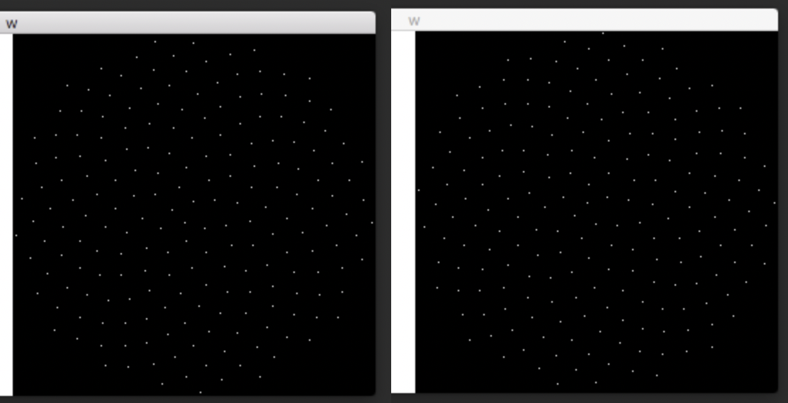

LED Sousaphone Bell
===================

by John Baylies - `sousastep.quest <https://www.sousastep.quest/>`_

Many thanks to the `Brooklyn College Sonic Arts <http://www.brooklyn.cuny.edu/web/academics/centers/ccm/education/sonicarts.php>`_ program and the `Performance And Interactive Media Arts <https://www.brooklyn.cuny.edu/web/academics/schools/mediaarts/interdisciplinary/graduate/pima/about.php>`_ program.

.. raw:: html

    <iframe width="100%" height="315" src="https://www.youtube.com/embed/K3kPgxQ373U" title="YouTube video player" frameborder="0" allow="accelerometer; autoplay; clipboard-write; encrypted-media; gyroscope; picture-in-picture; web-share" allowfullscreen></iframe>

.. note:: Check out `Jay Converse’s LED bell <https://wjla.com/news/local/gallery/web-exclusive-tuba-man?photo=1>`_ too!

Materials
---------

-  One dedicated sousaphone bell (this is a permanent installation) I used a fiberglass bell spray-painted black. the LEDs will stick to a lacquered bell just as well, but keep in mind that the LEDs will be soldered while they’re on the bell, which would not do the lacquer any favors.

-  `Condenser clip-on mic. <https://www.audio-technica.com/cms/wired_mics/8b8850105bdc46d6/index.html>`_ My max patch currently only uses amplitude data from the mic. It’s definitely possible to use a much cheaper mic, or even `solder your own. <https://learn.adafruit.com/adafruit-agc-electret-microphone-amplifier-max9814>`_

-  `Audio interface <https://www.reddit.com/r/audioengineering/wiki/faq#wiki_how_do_i_record_with_my_computer.3F__what.27s_an_interface.3F>`_

-  `Max/MSP <https://cycling74.com/>`_

-  `Teensy 3.2 <https://www.pjrc.com/store/teensy32.html>`_ A Teensy 4 will work as well.

-  `OctoWS2811 <https://www.pjrc.com/store/octo28_adaptor.html>`_

-  `Header pins <https://www.pjrc.com/store/header_14x1.html>`_

-  `Sockets <https://www.pjrc.com/store/socket_14x1.html>`_

-  `WS2812b RGB LED <https://www.amazon.com/Programmable-Aclorol-Individually-Addressable-Raspberry/dp/B07BKNS7DJ>`_ 

.. note::

   (200 LEDs needed for this tutorial, but definitely buy extras. Even the pros sometimes have trouble sourcing good ones that won’t burn out quickly) WS2812 LEDs were released to the world 7 years ago, and they’ve been improved upon since then. `Click here <https://hackaday.com/2019/03/26/can-you-live-without-the-ws2812/>`_ to read more about other types of LEDs.

-  `5V 50W PSU <https://www.aliexpress.com/item/4000221993487.html>`_

-  `Soldering Iron <https://www.testequipmentdepot.com/weller/soldering/soldering-stations/digital-we-soldering-station-120v-70w-we1010.htm>`_ (I bought a cheap soldering iron, hated it, then splurged on the Weller, which is great)

-  `Helping hands <https://www.amazon.com/Neiko-01902-Adjustable-Magnifying-Alligator/dp/B000P42O3C>`_

-  `lead solder <https://www.amazon.com/WYCTIN-Diameter-Electrical-Soldering-Purpose/dp/B071WQ9X5K>`_ (leadless solder is a PITA)

.. note::

   If you haven’t soldered before, Nic Collins’ book `Handmade Electronic Music <https://www.nicolascollins.com/handmade.htm>`_ is a great way to learn. Also, Adafruit has a `soldering guide <https://learn.adafruit.com/make-it-glow-how-to-solder-neopixels-a-beginners-guide>`_ specifically for LEDs.

-  Electrical tape and Gorilla tape

-  `Micro USB cable <https://www.digikey.com/short/zb93pw>`_

-  `USB extension cable <https://www.digikey.com/short/zb93z3>`_

-  `Barrel extension cable <https://www.digikey.com/short/zb934t>`_

-  `XLR cable <https://www.monoprice.com/product?p_id=4754>`_

-  `CAT6 cable <https://www.monoprice.com/product?p_id=9789>`_

-  `Stranded wire 22 AWG <https://www.pololu.com/product/2640>`_

-  Projector and tripod (the tripod matters more than the projector. 
   It must remain completely stationary for however long it takes you to place all of the LEDs on the bell)

Overview
--------

Max/MSP handles the VFX, and outputs a stream of RGB data to the Teensy, which uses the venerable OctoWS2811 to send RGB data to the ws2812b LEDs. Max must ensure that the RGB data is sent to the Teensy in the order in which the LEDs are wired to the OctoWS2811. Sometimes this stream of RGB data can become offset. To fix this we add start and end markers to each frame of RGB data .

Since Max can only send the numbers 0 - 255 to the Teensy, we clamp 0 - 253 so that 254 and 255 can be used as markers. There's not much of a difference in brightness at that end of the range, anyways.

The current Teensy code can be `downloaded from here <https://github.com/Sousastep/sousastep/blob/main/microcontrollers/teensy3_rec-RGB_send-touchRead/teensy3_rec-RGB_send-touchRead.ino>`_. This code also sends capacitive touch sense data from the Teensy 3.2 to Max, which can be used to control a noise gate so that it closes whenever you're not touching the mouthpiece. This helps prevent feedback in a live performance with lots of bass and/or reverb. You'll have to make some modifications to the code if you want to use this with a Teensy 4.0

I also tried receiving data from an accelerometer, but using it to control the VFX looked cheesy, and it made the frames stutter.

You can download my `VFX Max project here <https://github.com/jbaylies/sousastep/tree/main/Sousastep%20Visual%20FX>`_ (with the start and end markers). It's set up to work with my rig, so you'll have to modify it a bit, but maybe I could refactor it to work well with git branches...

Initial Setup
-------------

Start with the simplest possible setup to ensure that Max can control the LEDs before they're attached to the bell. 

`Click here <https://www.pjrc.com/store/octo28_adaptor.html>`_ for instructions on how to connect the OctoWS2811, Teensy 3.2, power supply, and LEDs.

Download `this folder o’ files. <https://github.com/jbaylies/Electrobrass_Encyclopedia/tree/master/docs/content/tutorials/data>`_ (without start and end markers)

Upload success.ino to the teensy by following `these instructions. <https://www.pjrc.com/teensy/teensyduino.html>`_

-  Open testpatch1.maxpat

-  Turn the patch’s audio on.

-  Clear the serial ports and locate the teensy.

-  Enable jit.world, and the LEDs should light up...

If only some of the LEDs light up, change this portion of the code:

.. code:: cpp

  const int ledsPerStrip = 26;
  const int numStrips = 8;

Getting the Coordinates
-----------------------

We can get a list of RGB data from Max by sending pixel coordinates to a matrix. You can arrange the LEDs in any pattern you'd like as long as there's an ordered list of coordinates, which will have to be reordered after the LED wiring order is determined.

Here’s how I got the coordinates for ``remappedLEDcoordinates.txt``

I found `this website, <http://iwant2study.org/lookangejss/math/Series_Numbers/ejss_model_FibonacciSpiral/>`_ clicked “table”, selected the first 200 coordinates, copy-pasted them into google sheets, exported the sheet as a csv file, and used `Justin G’s max patch <https://cycling74.com/forums/importing-from-excel-csv-questions>`_ to convert the csv file into Max’s coll object.

then,

.. figure:: media/max-scale-coords.png
   :width: 90%
   :alt: max-scale-coords.png

   This patch will get the Fib. Spiral showing up properly in jit.world

   Left, incorrect, flipped on x-axis. Right, correct. (challenge: turn the coordinates 90 degrees. It’d look more symmetrical.)

Arranging the LEDs
------------------

Project a screenshot of the spiral in jit.world onto the bell. Place the LEDs onto the projected dots while being mindful of the wiring order. You'll want to wire the 200 LEDs in eight groups of 25. You should use your own discretion to do this as efficiently as possible. 

One problem I faced is that I placed half the LEDs, then took a break for a few days, and when I tried to set up the projector again I learned that realigning the projector perfectly is impossible. This led to one speck of light hitting the flare of the bell the first time, and the throat of the bell the second time, which made me place one extra LED, which led to much confusion later on.

Once completed, the bell will look best from the projector's point of view.

   I used this diagram to reorder the coordinates from the Fibonacci spiral order to my wiring order. You can use it as a guideline, but be warned that it’s flipped on its X axis, and I had to account for one extra LED. Fibonacci index #29 corresponds to wiring index #35 and #170.

The top numbers are the Fibonacci indices, from `iwant2study.org <http://iwant2study.org/lookangejss/math/Series_Numbers/ejss_model_FibonacciSpiral/>`_. The bottom numbers are the wiring indices, which can be determined by turning on the first LED in each of the eight strips.

Typing those indices into a coll object allows the coordinates to be reordered using the patch below.

   This essentially makes the whole thing a big, low-resolution TV screen.
